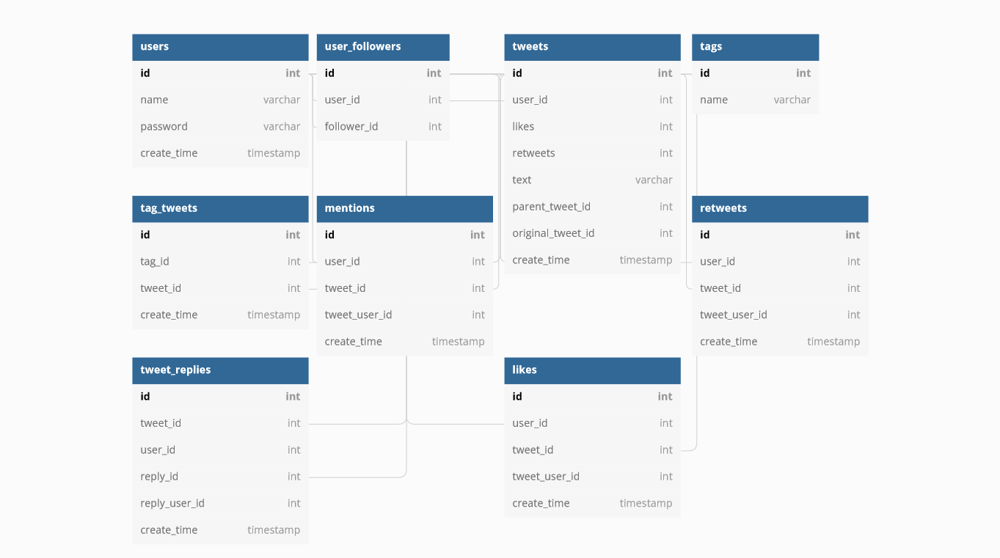
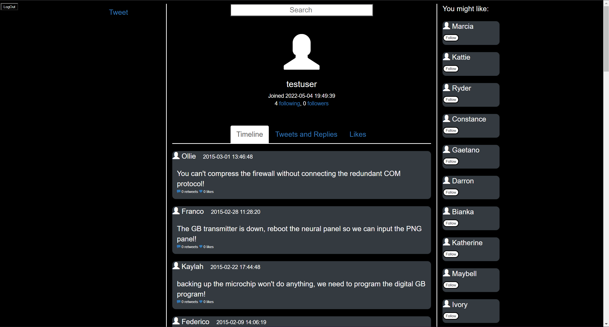
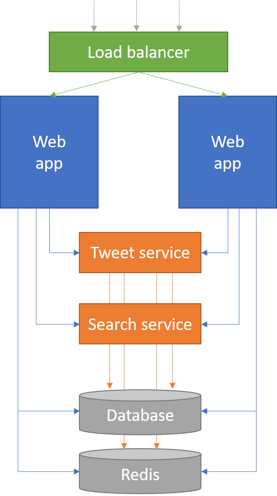

# NanoTwitter Technical Report
By: Long Yi, Zhendan Xu, Lisandro Mayancela

## Intro:
For our group project, we were asked to demonstrate our understanding of scalability (specifically scaling out) by first implementing a basic version of Twitter (NanoTwitter/NT), using Sinatra and Postgresql, which contains some of the main features of Twitter proper (Tweets, Replies, Hashtags, Searching, etc.). Once completed, we deployed our NT to Heroku and began testing the performance of the app using Loader.io and test routes in order to identify which areas of our Twitter failed under increased load so that we could begin to implement various scaling practices discussed in class. This report will briefly outline our implementation of NanoTwitter before going in depth into defining the scalability techniques utilized, how they were implemented in our project, and what impact they had on our project’s performance. Finally, our group will reflect upon our project and offer key takeaways.

## NanoTwitter Implementation & Architecture:
When designing the initial schema for our NanoTwitter we wanted to support the following basic functionality and queries (This isn’t a comprehensive list but it contains the essential functionality):

### Users
- Can post and reply to other tweets (“Return all of the tweets for a given user”/”Return all of this user’s replies”)
- Can follow other users (“How many users are following a given user?”/”Who is this user following?”)
- Can register/login/logout

### Tweets
- Can contain a hashtag and a mention which can then be used for searching (“What are the tweets that contain a given hashtag/mention?”)
- Can be replied to with another tweet (“What are the replies to this tweet?”/”Which tweet is this in response to?”)
- Can be retweeted (“Which/How many users have retweeted this tweet?”)

### Searching
- Can accept queries containing any number of keywords/hashtags/mentions and will return a “Timeline” of the most relevant tweets.

In order to achieve this, our group opted to have a schema consisting of 9 tables which can be observed below:



Once we had established the schema, our group split up the work of implementing the initial version as we created a UI, added model/integration tests, defined routes, included authentication using sessions, and finally deployed our first implementation of NanoTwitter to Heroku at the following link: https://cosi105nanotwitter.herokuapp.com (Below are screenshots of our UI). 




## NanoTwitter Scaling:
### Service Oriented Architecture
Our application is seperated into four types of services: load balancer, web app, Tweet service and search service. All services are talking to the same Postgres database and Redis cache. Below is the architecture of our application.


#### Load balancer
Our load balancer is a simple Sinatra app that dispatches the incoming requests to web apps using round-robin stratergy. The load balancer only dispatches get requests so that it can prevent users from accessing the web app illegaly using post requests.

#### Web app
This is the main service that has most of the NanoTwitter functionalities. In fact, it is very similar to the monolith version but without send Tweet and search functions. By adding more instances of this service, the system can scale out easily.

#### Tweet service
The Tweet service is responsible for handling new Tweets. It not only creates new Tweets but also does all the necessary work when a new Tweet is created such as dealing with tags and fanout. The jobs are handled asynchronously using threads.

#### Search service
This service is in charge of handling search requests with a given keyword and page. In the case that the user is only looking for the top 50 results of the search keyword, an additional thread is invoked which will asynchronously query either the cache or database (explained later) for the first 50 tweet results which is then provided to the frontend via the pusher gem. If the user were to go to the next page of results, the paged parameter would inform the service so that it returns tweet results 50 - 100 and so on.

### Indexing:
Indexing was the first avenue through which we tackled scaling our NanoTwitter as we had quickly realized that one of the most time consuming operations our app would need to perform was creating the timeline for a given user (list of tweets from users they are following and tweets that mention this user sorted by time). Without indexing, searches on a field such as the creation date would need to be linear, requiring the app to wait for the database to check, at worst, N records where N is the total number of records. For the tradeoff of requiring more disk space, we could instead index some of these fields so that their values can point to their corresponding entry, which is then sorted so that a faster search algorithm can be utilized. Thus, given how often we expect users to request their timeline (since it’s the first page the user sees after registering/logging-in), it was decided to add an index to the creation_date field of the Tweets table so that tweets can quickly be searched by that date. Furthermore, additional indices were added to the user_id foreign key of the Tweet table (tweet owner) as well as both foreign keys of the User_followers table. This was done in order to ensure that for any given user we would be able to not only quickly retrieve the user ids of their followers and followees, but also quickly retrieve the tweets which belong to any given user id. Finally, considering that users are searched via their usernames, we wanted to speed up the process in which a username can be used to retrieve its corresponding user_id. 

With all of this combined, our hope was that the use of these indices would provide a significant boost to how quickly timelines are created (For searches and home pages) and the following are some important changes we made to our schema:

#### Tweets
Added Index to user_id foreign key and create_time to speed up searching for tweets from a specific user and searching for tweets by when they were posted respectively

#### User_followers
Indexed both foreign keys in the table (follower_id, user_id). Composite index of follower_id and user_id to make queries for particular following relation even faster.

#### Users
Indexed name and create_time to allow for faster searches on usernames and ordering by creation time. 

### Caching:
Caching is the most important stratergy we use to scale our application. We gain a huge performance boost when we first migrated our application from database only to cache on top of database design. The result of performance tests will be discussed later. We use cache for all frequent operations such as generating timeline, fetching followers and followees, searching, as well as generating a list of users one might like. By using cache, database usage is cut down to a minimal level. 90% of table joins are replaced by quries on one table. Caches are warmed up right after the login event. The following are the details of how caching is used:

#### Timeline cache
Timeline consists of the most recent Tweets posted by the user and all users he/she is following. For every user, the latest 1000 Tweet ids on the timeline are cached. We use sorted sets to hold Tweet ids so they are sorted in time order. 

#### Followers/Followees cache
There are a lot places we need to get all the followers and followees of a user besides diplaying followers/followees list. For example, when fetching timeline, we need the list followees in order to find all Tweets they posted. So for every user, we use two sorted sets to keep track of both the followers and followees. With the help of these caches, we can get rid of table joins when querying the database.

#### Recommended users cache
There is a list of users in the you might like section on the homepage. The recommended users are worth caching because the 'you might like list' is displayed every time a user accesses homepage. We are caching both the user id and name of at most 100 recommendations for every user. If the cache size is smaller than 10, we will refill the cache upto 100. As a result, the database is no longer involved when we generate the you might like list. 

#### Search cache
Similarly to the timeline cache, we wanted to reduce the amount of work our database performs when searching for any given keyword. As such, our search cache will store the first 50 tweets that are the search result for the given keyword so that future searches on that keyword won't need to query the database unless the user requests to see more results from that query (the next 50 tweets by going to the next page).

### Testing:
Prior to testing our application we first needed to establish a testing framework that would offer us a way to set up, execute, and then reset our tests. Moreover, we required the use of logging so that we could more precisely identify issues in our code and report the results of our tests. For our testing framework our group created routes such as those shown below (Not every test route is included):

/test/reset

/test/stress

/test/performance

/test/status

Using the stress test as an example of how our testing framework was designed, these tests work by first defining the parameters for the test and then storing the current time as a variable (start_time/time_sum) which is then used to calculate the time it took for the operation that is being examined. In the case of the stress test, we were interested in the speed of following, tweeting, and fetching the user’s timeline. A code snippet of our stress test will be used to assist explanation:
    
``` ruby
get "/test/stress" do
    n = params[:n].to_i
    star = params[:star].to_i
    fan = params[:fan].to_i
 
# CODE SNIPPET. THIS ISN’T THE ENTIRE TEST
 
    text_list = []
    id_list = []
    time_sum = 0
    1.upto(n) do |i|
        text = Faker::Name.name+" "+Faker::Verb.past+" "+Faker::Hobby.activity
        start_time = Time.now()
        tweet = doTweet(text, star)
        time_sum += Time.now()-start_time
        text_list.append(text)
        id_list.append(tweet.id)
    end
    LOGGER.info("TEST STRESS: userid=#{star} creates tweet AVERAGE TIME COST: #{time_sum/n} SECONDS")
 
    [200, "OK"]
end
``` 
In order to test tweeting, we defined a variable time_sum which will store the total amount of time it took to perform n (parameter) tweets for user star (user_id passed as parameter). For each tweet, fake data using the Faker gem is created and then the time taken to create the tweet is calculated and added to time_sum. Once completed, the Logger gem is used to report the results of the test which we then reviewed via Papertrail.

### Results of Scaling/Conclusion:
Below are the results of both scalability runoffs

Scalability Runoff 1: Client Load up to 1000
   - Average response time (ms): 9906
   - Timeouts: 185
   - Completed?: no
   - Timeout at?: under 500 users

Scalability Runoff 2: Client Load up to 3000

    Test 1: 2000 Clients
        - Average response time (ms): 6463
        - Timeouts: 0
        - Completed?: yes
        - Timeout at?: N/A
        
    Test 2: 3000 Clients
        - Average response time (ms): 8686
        - Timeouts: 1385
        - Completed?: yes
        - Timeout at?: 2700+ users

As can be observed from the scalability runoff, our app saw a massive jump in performance between the first and second rounds, going from a 10 second response during a load of under 500 users to being able to handle 2000 clients with under 6.5 second response times and zero timeouts. While the reason was partly due to our cache being warmed up from the first runoff's timelines and searches, the pulling out of our tweeting functionality into its own service coupled with fixes to homepage caching and fanning out new tweets to follower's timelines brought significant improvements to the performance of NanoTwitter as exemplified by not only the second runoff, but the following stress tests that were performed after further optimization as well:

(Times are in seconds)
(Tests were performed three times to account for any variations between tests)

Mar28:
- follow: 0.032 0.006 0.024
- tweet: 0.013 0.008 0.010
- timeline:0.091 0.155 0.087

May3:
- follow: 0.004 0.002 0.002
- tweet: 0.06 0.06 0.08
- timeline: 0.02 0.019 0.017

For follow and timeline we notice the largest decrease in response time which is consistent with our caching for both of these features. However, we don't have much improvement on tweeting, which is natural since there's essential nothing to cache so we couldn't really improve this.

Overall we are incredibly pleased with not only the number of scalability practices our team was able to implement, but the vast improvements to performance that we observed as a result of their implementation. This project, and the course as a whole, has given us new perspective on how to approach building apps at an architectural level and we can say with confidence that the strategies employed for NanoTwitter are tools that will be employed often throughout the rest of our careers in tech. 


## How to Run and Other Notes:
* ### Ruby version
    "3.0.3"

* ### System dependencies
    "thin", "puma", "reel", "http", "webrick", "rake", "sinatra", "activerecord", "sinatra-activerecord", "pg", "rack-test", "faker", "bcrypt", "redis", "connection_pool", "thread", "faraday", "pusher"

* ### Database creation
    rake db:create

    rake db:migrate

* ### How to run the app
    load balancer: ruby app_lb.rb

    web app: ruby app.rb

    tweet service: ruby tweet.rb        

* ### generate random data
    calling the route: localhost:5467/generateRandomData
    generates 50 random users and 200 random tweets etc. for testing 

* ### Deployment
    https://cosi105nanotwitter.herokuapp.com/home

* ### Change History
    NT-0.1 Feb14: create active record scheme, migration (Zhendan), and testing suite (Long)

    NT-0.2 Mar2: create frontend UI (Long), deploy to heroku (Zhendan), create routes (Lisandro), authentication (Zhendan)

    NT-1.0 Mar14: implement core function including user following (Zhendan), tweeting (Long), and timeline (Long)

    NT-1.1 Mar16: add test interface (Zhendan, Long)

    NT-1.2 Apr4: migrate follow related operations to redis (Zhendan)

    NT-1.3 Apr28: home page caching (Long), Tweet fanout (Zhendan)

    NT-2.0 May2: switch to service oriented architecture (Zhendan), improve search performance (Long)

    NT-2.1 May3: add load balencer (Zhendan), improve home page performance (Zhendan)

    NT-2.2 May4: reommend users (Zhendan)


  
